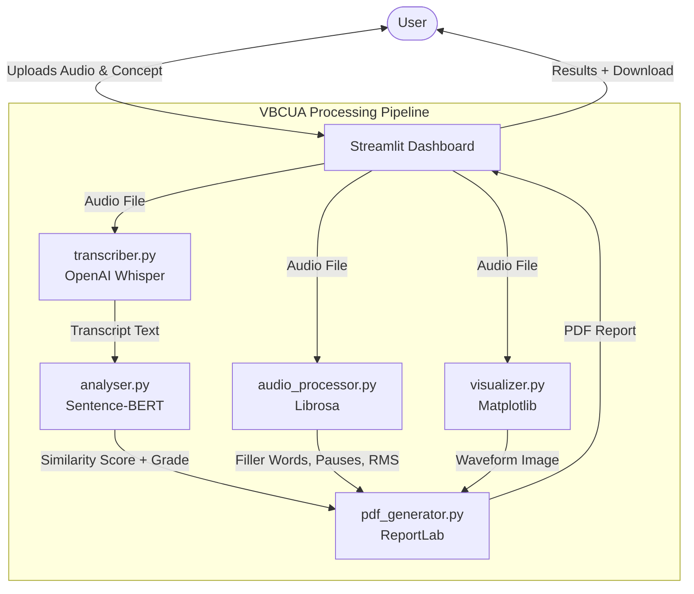
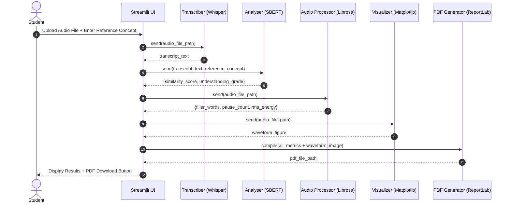
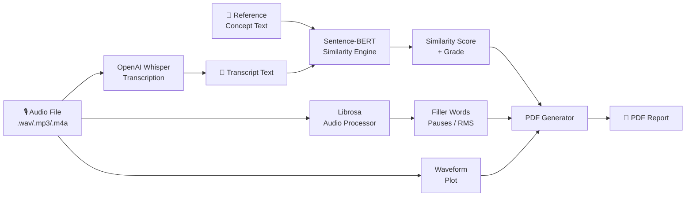

# Project Design Specifications - Voice-Based Concept Understanding Analyser

This document details the architectural layout, module design, data flow, and system workflows for the VBCUA application.

---

## 1. System Architecture

VBCUA uses a clean, modular pipeline architecture within a single Streamlit application. Each processing stage is handled by a dedicated Python module.



---

## 2. Module Design

### `transcriber.py` — Speech-to-Text Engine
- **Responsibility**: Load the Whisper model and transcribe an audio file path to a text string.
- **Key Function**: `transcribe(audio_path: str, model_size: str = "base") -> str`
- **Dependencies**: `openai-whisper`, `torch`

### `analyser.py` — Semantic Similarity Engine
- **Responsibility**: Encode the transcript and reference concept using Sentence-BERT and compute cosine similarity.
- **Key Functions**:
  - `compute_similarity(transcript: str, reference: str) -> float`
  - `get_understanding_grade(score: float, threshold: float = 0.75) -> str`
- **Dependencies**: `sentence-transformers`

### `audio_processor.py` — Vocal Analytics Engine
- **Responsibility**: Load the audio waveform with Librosa and extract vocal metrics.
- **Key Function**: `analyse_audio(audio_path: str) -> dict`
  - Returns: `filler_words`, `filler_word_count`, `pause_count`, `avg_pause_duration_sec`, `rms_energy`
- **Dependencies**: `librosa`, `numpy`

### `visualizer.py` — Waveform Visualization Engine
- **Responsibility**: Generate waveform and spectrogram plots from the audio file.
- **Key Functions**:
  - `plot_waveform(audio_path: str) -> matplotlib.Figure`
  - `plot_spectrogram(audio_path: str) -> matplotlib.Figure`
- **Dependencies**: `librosa`, `matplotlib`

### `pdf_generator.py` — Report Generation Engine
- **Responsibility**: Compile all analysis results and generate a structured, branded PDF report.
- **Key Function**: `generate_report(data: dict, output_path: str) -> str`
- **Dependencies**: `reportlab`

---

## 3. Dynamic Workflow Design

### A. Full Assessment Workflow Sequence
The complete evaluation flow when a student uploads audio and provides a reference concept:



---

## 4. Data Flow Design



---

## 5. UI Design Wireframe

The Streamlit dashboard is divided into four logical sections:

```
+----------------------------------------------------------+
|  VBCUA — Voice-Based Concept Understanding Analyser      |
+----------------------------------------------------------+
|  [Sidebar]                | [Main Panel]                  |
|  - Whisper Model Size     |  1. UPLOAD SECTION            |
|  - Similarity Threshold   |     Upload Audio + Enter Ref  |
|  - Student Name           |                               |
|  - Concept Name           |  2. TRANSCRIPT                |
|                           |     Whisper Output Text       |
|                           |                               |
|                           |  3. RESULTS SECTION           |
|                           |     Similarity Score + Grade  |
|                           |     Filler Words + Pauses     |
|                           |     RMS Energy               |
|                           |                               |
|                           |  4. VISUALIZATION             |
|                           |     Waveform + Spectrogram    |
|                           |                               |
|                           |  5. REPORT DOWNLOAD           |
|                           |     [ Download PDF Report ]   |
+----------------------------------------------------------+
```
