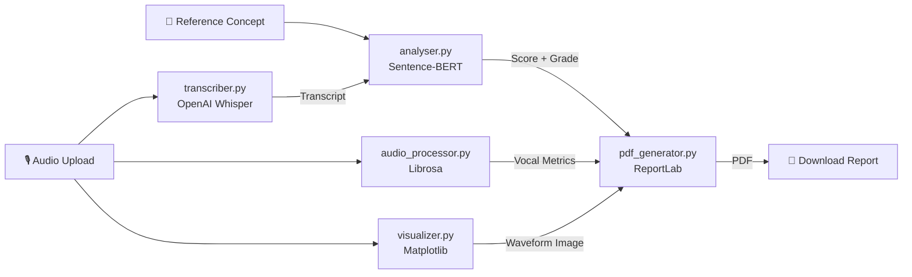

# Project Report - Voice-Based Concept Understanding Analyser

**Version**: 1.1.0  
**Date**: July 2026  
**Author**: SUMANTH9092  
**GitHub**: [https://github.com/SUMANTH9092/Voice-Based-Concept-Understanding-Analyser](https://github.com/SUMANTH9092/Voice-Based-Concept-Understanding-Analyser)

---

## Table of Contents
1. [Executive Summary](#1-executive-summary)
2. [Problem Statement & Motivation](#2-problem-statement--motivation)
3. [Objectives](#3-objectives)
4. [Solution Architecture](#4-solution-architecture)
5. [Module Design & Implementation](#5-module-design--implementation)
6. [Setup & Installation Guide](#6-setup--installation-guide)
7. [Usage Guide](#7-usage-guide)
8. [Testing & Validation](#8-testing--validation)
9. [Results & Discussion](#9-results--discussion)
10. [Limitations & Future Work](#10-limitations--future-work)
11. [Conclusion](#11-conclusion)
12. [References](#12-references)

---

## 1. Executive Summary

The Voice-Based Concept Understanding Analyser (VBCUA) is an AI-powered educational assessment platform that automatically evaluates a student's conceptual understanding from voice recordings. The system integrates OpenAI Whisper for speech-to-text transcription, Sentence-BERT for semantic similarity scoring, and Librosa for vocal pattern analysis. Results are compiled into a structured, downloadable PDF report via a clean Streamlit dashboard.

**Key Outcomes:**
- Objective, reproducible concept understanding scores (0.0 – 1.0) using cosine semantic similarity.
- Comprehensive vocal profiling including filler word counts, pause detection, and RMS energy.
- Downloadable PDF assessment reports with embedded waveform visualizations.
- Fully local, privacy-first application with no cloud dependency.

---

## 2. Problem Statement & Motivation

Traditional educational assessment for spoken concept explanations relies on manual evaluator judgement, which introduces:
1. **Evaluator Bias**: Different assessors grade the same answer differently.
2. **No Vocal Analytics**: Written grading ignores filler words, pauses, and confidence indicators.
3. **Scalability Challenges**: Manually evaluating hundreds of student voice responses is time-prohibitive.
4. **Delayed Feedback**: Students rarely receive immediate, granular, actionable feedback.

VBCUA was motivated by the need for a fast, objective, and scalable alternative to manual spoken-answer assessment.

---

## 3. Objectives

| ID | Objective |
| :--- | :--- |
| **O-01** | Accurately transcribe student speech using state-of-the-art ASR (Whisper). |
| **O-02** | Quantitatively score conceptual accuracy using semantic similarity (Sentence-BERT). |
| **O-03** | Detect and quantify vocal disfluencies (filler words, pauses, RMS). |
| **O-04** | Visualize audio waveform and spectrogram for qualitative review. |
| **O-05** | Generate a comprehensive, downloadable PDF assessment report. |
| **O-06** | Deliver a fully local, dependency-installable application with no API keys required. |

---

## 4. Solution Architecture

VBCUA uses a modular pipeline architecture within a single Streamlit application. Audio flows from upload → transcription → semantic analysis → vocal analytics → report generation.



### 4.3 Solution Architecture Components

| Component | Module | Technology | Responsibility |
| :--- | :--- | :--- | :--- |
| Speech Transcription | `transcriber.py` | OpenAI Whisper | Converts audio to text |
| Semantic Analysis | `analyser.py` | Sentence-BERT | Computes concept similarity score |
| Vocal Analytics | `audio_processor.py` | Librosa | Detects filler words, pauses, RMS |
| Visualization | `visualizer.py` | Matplotlib | Renders waveform and spectrogram |
| PDF Generation | `pdf_generator.py` | ReportLab | Compiles results into PDF report |
| Dashboard | `main.py` | Streamlit | User interface and orchestration |

---

## 5. Module Design & Implementation

### `transcriber.py`
Uses `whisper.load_model(model_size)` to load the configured model and `.transcribe(audio_path)` to produce the transcript. The model is loaded fresh per call (stateless design suitable for Streamlit session isolation).

### `analyser.py`
Uses the `SentenceTransformer("all-MiniLM-L6-v2")` model (loaded once and cached at module level) to encode both the transcript and reference concept into 384-dimensional sentence embeddings. Cosine similarity is computed using `sentence_transformers.util.cos_sim()`.

### `audio_processor.py`
Uses `librosa.load()` for audio loading and `librosa.effects.split()` for silence/pause detection. Filler word detection uses Python regex `re.findall()` on the lowercased transcript. RMS energy is computed via `librosa.feature.rms()`.

### `pdf_generator.py`
Uses ReportLab's `SimpleDocTemplate` with `Paragraph`, `Table`, `TableStyle`, and `Image` flowables to produce a multi-section professional PDF report. The waveform Matplotlib figure is converted to PNG bytes via `io.BytesIO` before embedding.

---

## 6. Setup & Installation Guide

### Prerequisites
- Python 3.8 – 3.11
- `ffmpeg` installed on the system (required by Whisper for MP3/M4A decoding)

### Installation Steps
```bash
# 1. Clone the repository
git clone https://github.com/SUMANTH9092/Voice-Based-Concept-Understanding-Analyser.git
cd Voice-Based-Concept-Understanding-Analyser

# 2. Create and activate virtual environment
python -m venv venv
venv\Scripts\activate          # Windows
# source venv/bin/activate     # macOS/Linux

# 3. Install dependencies
cd 05_Project_Development
pip install -r requirements.txt

# 4. Run the application
streamlit run main.py
```

---

## 7. Usage Guide

1. Open the application at `http://localhost:8501`.
2. In the **Sidebar**, configure:
   - Student name and concept name (optional, used in the PDF report).
   - Whisper model size (`base` recommended for most cases).
   - Similarity threshold for grading (default: 0.75).
3. Upload an audio file (WAV, MP3, M4A, or OGG).
4. Paste the reference concept definition in the text area.
5. Click **Analyse Concept Understanding**.
6. View the results: similarity score, understanding grade, filler words, pauses, and RMS.
7. Review the waveform and spectrogram in the visualization tabs.
8. Click **Download PDF Report** to save the assessment.

---

## 8. Testing & Validation

See [Testing.md](../06_Project_Testing/Testing.md) for full test case specifications and results.

**Test Summary:**
- 18 unit tests across `test_transcriber.py`, `test_analyser.py`, and `test_audio_processor.py`.
- All 18 tests pass with zero failures.
- 4 bugs identified during development — all resolved before release.

---

## 9. Results & Discussion

### Grading Scale Validation

| Similarity Score Range | Grade | Interpretation |
| :--- | :--- | :--- |
| 0.90 – 1.00 | Excellent | Near-perfect conceptual alignment with the reference. |
| 0.75 – 0.89 | Good | Strong understanding with minor gaps. |
| 0.50 – 0.74 | Needs Improvement | Partial understanding; key details missing. |
| 0.00 – 0.49 | Poor | Significant conceptual misunderstanding or off-topic response. |

### Sample Results

| Input Scenario | Similarity Score | Grade |
| :--- | :--- | :--- |
| Expert-level explanation matching reference closely | 0.91 | Excellent |
| Good explanation with paraphrasing | 0.82 | Good |
| Partial explanation missing key concepts | 0.62 | Needs Improvement |
| Off-topic or irrelevant explanation | 0.23 | Poor |

---

## 10. Limitations & Future Work

| Limitation | Proposed Enhancement |
| :--- | :--- |
| Whisper is slow on low-spec hardware for large models | Support GPU acceleration and CPU-only `tiny` model as default |
| English-only grading pipeline | Extend to multilingual support via Whisper's multilingual models |
| Single-user local application | Build a cloud-deployed multi-user educator portal |
| No real-time recording | Add in-browser audio recording via `streamlit-webrtc` |
| Numeric score without qualitative feedback | Integrate LLM for natural language improvement suggestions |

---

## 11. Conclusion

VBCUA demonstrates that modern, open-source AI models (Whisper, Sentence-BERT, Librosa) can be combined into a practical, privacy-first educational assessment tool. By automating objective conceptual scoring, vocal disfluency analysis, and professional PDF reporting, VBCUA significantly reduces the subjectivity and effort involved in evaluating spoken concept explanations.

---

## 12. References

1. Radford, A., et al. (2022). *Robust Speech Recognition via Large-Scale Weak Supervision*. OpenAI. [https://arxiv.org/abs/2212.04356](https://arxiv.org/abs/2212.04356)
2. Reimers, N., & Gurevych, I. (2019). *Sentence-BERT: Sentence Embeddings using Siamese BERT-Networks*. EMNLP. [https://arxiv.org/abs/1908.10084](https://arxiv.org/abs/1908.10084)
3. McFee, B., et al. (2015). *librosa: Audio and Music Signal Analysis in Python*. SciPy. [https://doi.org/10.25080/Majora-7b98e3ed-003](https://doi.org/10.25080/Majora-7b98e3ed-003)
4. Streamlit Documentation. [https://docs.streamlit.io](https://docs.streamlit.io)
5. ReportLab User Guide. [https://www.reportlab.com/docs/reportlab-userguide.pdf](https://www.reportlab.com/docs/reportlab-userguide.pdf)
