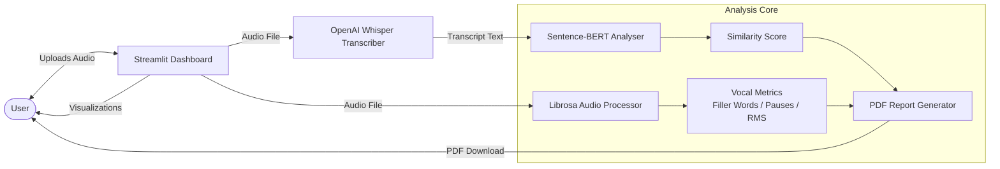
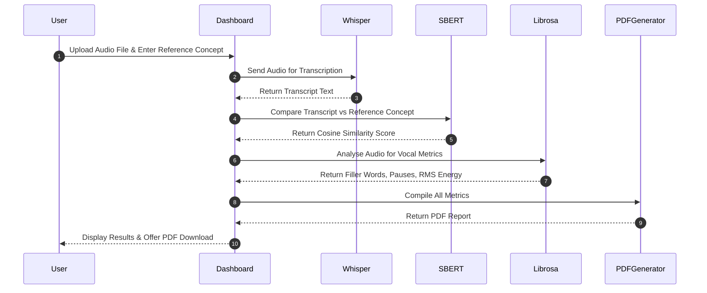
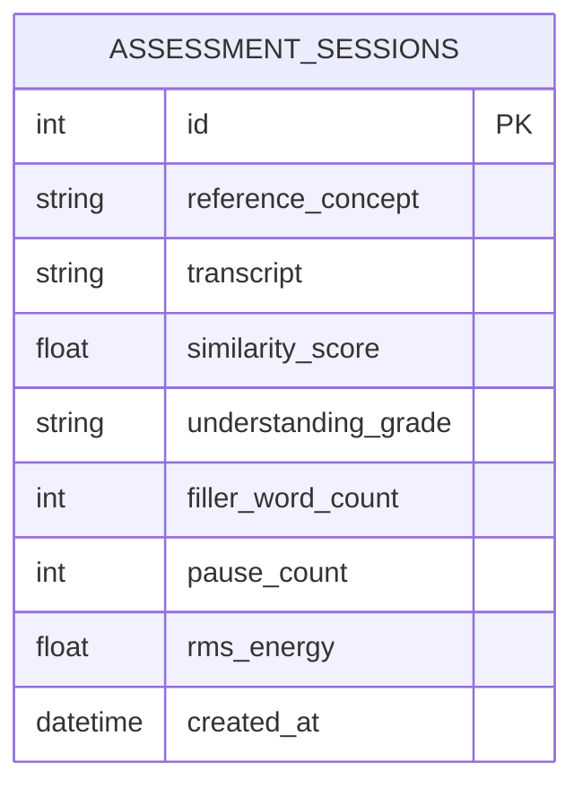

# Voice-Based Concept Understanding Analyser

<div align="center">

[](LICENSE)
[](https://www.python.org/)
[](https://streamlit.io/)
[](https://github.com/openai/whisper)

*An AI-Powered Educational Assessment Platform that Evaluates Conceptual Understanding Through Spoken Explanations.*

[Explore Docs](07_Project_Documentation/Project_Report.md) · [Submit Issue](https://github.com/SUMANTH9092/Voice-Based-Concept-Understanding-Analyser/issues)

</div>

---

## 📖 Table of Contents
- [Project Overview](#-project-overview)
- [Problem Statement](#-problem-statement)
- [The Solution](#-the-solution)
- [Key Features](#-key-features)
- [Technology Stack](#-technology-stack)
- [SDLC Repository Folder Structure](#-sdlc-repository-folder-structure)
- [System Architecture](#-system-architecture)
- [Application Workflow](#-application-workflow)
- [Installation & Local Setup](#-installation--local-setup)
- [Configuration](#-configuration)
- [Running the Project](#-running-the-project)
- [Screenshots & User Interface](#-screenshots--user-interface)
- [Sample Input & Output](#-sample-input--output)
- [Database Design](#-database-design)
- [Testing Suite](#-testing-suite)
- [Security Features](#-security-features)
- [Error Handling](#-error-handling)
- [Future Enhancements](#-future-enhancements)
- [Contributors](#-contributors)
- [License](#-license)
- [Acknowledgements](#-acknowledgements)

---

## 🌟 Project Overview
**Voice-Based Concept Understanding Analyser (VBCUA)** is an intelligent AI-powered educational assessment platform designed to evaluate and analyse a student's conceptual understanding through spoken explanations. By processing audio recordings through OpenAI Whisper for transcription and Sentence-BERT for semantic analysis, VBCUA delivers detailed insights on concept clarity, filler word usage, pause patterns, and voice energy levels — all consolidated into a downloadable PDF report.

---

## ❓ Problem Statement
Traditional concept assessment in education faces several critical limitations:
1. **Subjective Evaluation**: Manual assessment of student explanations is inconsistent and prone to evaluator bias.
2. **Lack of Real-Time Feedback**: Students rarely receive immediate, data-driven feedback on the clarity and depth of their spoken answers.
3. **Missed Vocal Patterns**: Conventional evaluations ignore key vocal metrics like filler words, unnatural pauses, and voice energy that indicate true comprehension levels.

---

## 💡 The Solution
VBCUA addresses these problems by:
- **Automatic Speech Transcription**: Leveraging OpenAI Whisper to accurately convert student speech into text, supporting multiple languages.
- **Semantic Similarity Analysis**: Using Sentence-BERT to compute cosine similarity between the student's explanation and the reference concept definition, giving an objective understanding score.
- **Vocal Analytics Engine**: Employing Librosa to detect filler words, measure pause durations, and analyse RMS energy levels from raw audio waveforms.
- **Comprehensive PDF Reporting**: Auto-generating a detailed performance report for each assessment session that can be shared with educators.

---

## 🛠️ Key Features
- **🎙️ Speech-to-Text Transcription**: Converts voice recordings to text using OpenAI Whisper with high accuracy.
- **📊 Semantic Similarity Scoring**: Compares student explanations against reference definitions using Sentence-BERT cosine similarity.
- **🔍 Concept Understanding Evaluation**: Grades student responses on a multi-tier scale (Excellent / Good / Needs Improvement / Poor).
- **⏸️ Filler Word & Pause Detection**: Identifies filler words (um, uh, like, you know) and unnatural pauses in speech using Librosa.
- **🔊 RMS Energy Analysis**: Analyses voice energy levels to assess speaker confidence and vocal projection.
- **📈 Waveform Visualization**: Renders real-time audio waveforms and spectrogram plots within the interactive dashboard.
- **📄 PDF Report Generation**: Produces a structured, downloadable PDF report summarizing all evaluation metrics.
- **🖥️ Interactive Dashboard**: Presents all results in a clean, responsive Streamlit interface.

---

## ⚙️ Technology Stack
- **Core Language**: Python (3.8 - 3.11)
- **Speech Recognition**: OpenAI Whisper
- **Semantic Analysis**: Sentence-BERT (`sentence-transformers`)
- **Audio Processing**: Librosa
- **Frontend Dashboard**: Streamlit
- **PDF Report Generation**: ReportLab / FPDF
- **Visualization**: Matplotlib, Librosa Display
- **Data Validation**: Pydantic
- **Environment Management**: python-dotenv

---

## 📂 SDLC Repository Folder Structure
To ensure a professional and structured engineering portfolio, this repository is organized into phases matching the **Software Development Life Cycle (SDLC)**:

```text
Voice-Based-Concept-Understanding-Analyser/
├── .github/
│   ├── ISSUE_TEMPLATE/
│   │   ├── bug_report.md
│   │   └── feature_request.md
│   └── workflows/
│       └── python-app.yml
├── 01_Brainstorming/
│   ├── Idea.md
│   └── Brainstorming.md
├── 02_Requirement_Analysis/
│   └── Requirements.md
├── 03_Project_Design/
│   └── Design.md
├── 04_Project_Planning/
│   └── Planning.md
├── 05_Project_Development/
│   ├── app/
│   │   ├── analyser.py
│   │   ├── audio_processor.py
│   │   ├── pdf_generator.py
│   │   ├── transcriber.py
│   │   └── visualizer.py
│   ├── tests/
│   │   ├── test_analyser.py
│   │   ├── test_audio_processor.py
│   │   └── test_transcriber.py
│   ├── requirements.txt
│   └── main.py
├── 06_Project_Testing/
│   └── Testing.md
├── 07_Project_Documentation/
│   └── Project_Report.md
├── 08_Project_Demonstration/
│   └── Demonstration.md
├── Screenshots/
│   ├── dashboard.png
│   ├── waveform.png
│   ├── similarity_score.png
│   ├── filler_detection.png
│   └── pdf_report.png
├── .gitignore
├── CHANGELOG.md
├── CODE_OF_CONDUCT.md
├── CONTRIBUTING.md
└── LICENSE
```

---

## 🏗️ System Architecture
VBCUA is built on a clean, modular pipeline architecture. Below is the architectural diagram showing how audio data flows from the user through transcription, semantic analysis, vocal analytics, and report generation.



---

## 🔁 Application Workflow
The sequence of operations during a concept evaluation session:



---

## 🚀 Installation & Local Setup
Get your environment up and running in minutes:

### 1. Clone the repo
```bash
git clone https://github.com/SUMANTH9092/Voice-Based-Concept-Understanding-Analyser.git
cd Voice-Based-Concept-Understanding-Analyser
```

### 2. Set up virtual environment
```bash
python -m venv venv
# Activate on Windows:
venv\Scripts\activate
# Activate on macOS/Linux:
source venv/bin/activate
```

### 3. Install dependencies
```bash
cd 05_Project_Development
pip install -r requirements.txt
```

> **Note**: OpenAI Whisper requires `ffmpeg` to be installed on your system. Install it via:
> - Windows: `choco install ffmpeg` (or download from [ffmpeg.org](https://ffmpeg.org))
> - macOS: `brew install ffmpeg`
> - Linux: `sudo apt install ffmpeg`

---

## ⚙️ Configuration
1. Create a `.env` file inside the development directory:
   ```bash
   cd 05_Project_Development
   cp .env.example .env
   ```
2. Open `.env` and configure your settings:
   ```env
   WHISPER_MODEL=base          # Options: tiny, base, small, medium, large
   SIMILARITY_THRESHOLD=0.75   # Cosine similarity threshold for "Good" rating
   MAX_AUDIO_DURATION=300      # Max allowed audio duration in seconds
   ```

---

## 🏃 Running the Project
Launch the Streamlit application from inside `05_Project_Development/`:

```bash
cd 05_Project_Development
streamlit run main.py
```

- **Streamlit Web Application**: [http://localhost:8501](http://localhost:8501)

---

## 📸 Screenshots & User Interface
Here is a look at the application interfaces:

### Main Assessment Dashboard


### Audio Waveform & Spectrogram Visualization


### Semantic Similarity Score & Concept Evaluation


### Filler Word & Pause Detection Results


---

## 📂 Sample Input & Output

### Input
- **Reference Concept**: `Machine learning is a subset of artificial intelligence that enables systems to automatically learn and improve from experience without being explicitly programmed.`
- **Audio Recording**: Student explains the concept of Machine Learning for 60 seconds.

### Output
```json
{
  "transcript": "Machine learning is basically when computers learn from data automatically. It's like, um, they use algorithms to, uh, identify patterns and improve over time without someone writing specific instructions.",
  "similarity_score": 0.82,
  "understanding_grade": "Good",
  "filler_words_detected": ["like", "um", "uh"],
  "filler_word_count": 3,
  "pause_count": 5,
  "avg_pause_duration_sec": 0.8,
  "rms_energy": 0.043,
  "pdf_report": "VBCUA_Report_20260715_103000.pdf"
}
```

---

## 🗄️ Database Design
VBCUA maintains a local session log using SQLite (optional) for tracking evaluation history.

| Column Name | Data Type | Key Type | Nullable | Description |
| :--- | :--- | :--- | :--- | :--- |
| `id` | `INTEGER` | Primary Key | No | Auto-incrementing session identifier. |
| `reference_concept` | `VARCHAR(1000)` | - | No | The reference concept text provided by the user. |
| `transcript` | `TEXT` | - | No | The Whisper-generated transcript of the audio. |
| `similarity_score` | `FLOAT` | - | No | Cosine similarity score between transcript and reference. |
| `understanding_grade` | `VARCHAR(50)` | - | No | Categorical grade (Excellent/Good/Needs Improvement/Poor). |
| `filler_word_count` | `INTEGER` | - | Yes | Total count of detected filler words. |
| `pause_count` | `INTEGER` | - | Yes | Total number of detected unnatural pauses. |
| `rms_energy` | `FLOAT` | - | Yes | Average RMS energy of the audio. |
| `created_at` | `DATETIME` | - | No | UTC timestamp of the assessment session. |



---

## 🧪 Testing Suite
Automated unit tests cover transcription, similarity analysis, audio processing, and vocal metrics detection.

Run the test suite locally inside `05_Project_Development/`:
```bash
cd 05_Project_Development
python -m unittest discover -s tests
```

---

## 🔒 Security Features
- **Decoupled Configuration**: Sensitive settings and model paths are handled using `python-dotenv` and ignored in `.gitignore`.
- **Audio File Validation**: Uploaded audio files are validated for supported formats (`.wav`, `.mp3`, `.m4a`, `.ogg`) and maximum duration before processing.
- **In-Memory Processing**: Audio files are processed in-memory and not persistently stored on disk beyond the session duration.

---

## 🚫 Error Handling
VBCUA handles errors gracefully:
- **Unsupported Audio Format**: Returns a descriptive error if an unsupported audio format is uploaded.
- **Audio Too Long**: Returns a warning and rejects processing if the audio exceeds the configured `MAX_AUDIO_DURATION`.
- **Transcription Failure**: Falls back to a safe error message if Whisper fails to process the audio, logging the exception to stdout.
- **Low Similarity Score**: If the score falls below a minimum threshold, a "Poor" grade with improvement suggestions is returned.

---

## 🔮 Future Enhancements
- [ ] **Multi-Language Support**: Extend Whisper transcription to support automatic language detection and non-English concept evaluation.
- [ ] **Educator Dashboard**: Build a teacher-facing portal to manage students, assign concepts, and view aggregated assessment analytics.
- [ ] **Real-Time Recording**: Allow students to record directly within the browser instead of uploading pre-recorded files.
- [ ] **LLM-Based Feedback**: Integrate an LLM (e.g., Google Gemini or GPT-4o) to generate personalized, natural-language improvement suggestions alongside the numeric metrics.
- [ ] **Cloud Deployment**: Deploy on AWS/GCP with persistent session storage and multi-user support.

---

## 👥 Contributors
- **SUMANTH** (Lead Developer) - [GitHub: SUMANTH9092](https://github.com/SUMANTH9092)

---

## 📄 License
Distributed under the MIT License. See [LICENSE](LICENSE) for more details.

---

## 💖 Acknowledgements
- OpenAI Whisper development team
- Sentence-Transformers / SBERT research community
- Librosa audio analysis library contributors
- Streamlit open-source community
- ReportLab PDF generation library
